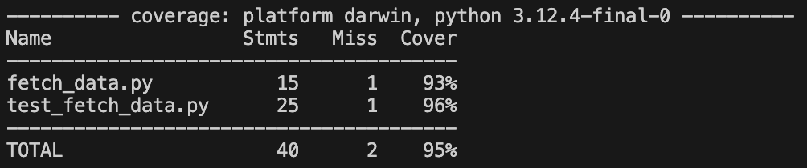

## Testing 
- `test_fetch_data.py`

This file will test for if it's actually getting called and if it's getting called exactly once.
 It will also test that an exception is raised when an id is inserted that isn't a number (integer technically).
 We decided not to test the actual integer as even though we have 50 plants right now, this number may change.
 We also checked the coverage and it gave 95% which we are happy with so moved on.

