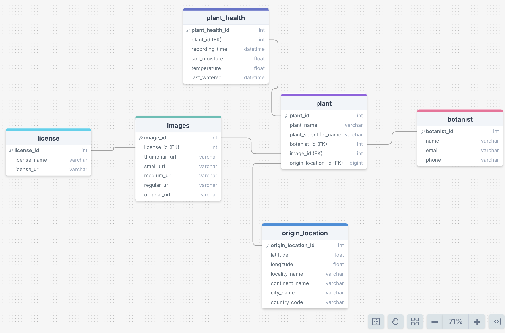

# Welcome to the LMNH Plants Data Pipeline!


## Installation

Use the package manager `pip3` to installed required libraries from `requirements.txt`. It is is recommended that this command is run in a virtual environment `.venv`.

```bash
pip3 install -r requirements.txt
```
## Key Files Overview

`README.MD` -> This file, basic documentation and description.

`fetch_data.py` -> Script that asynchronously fetches the raw data from the plants API.

`test_fetch_data.py` -> Script that tests correct functionality of `fetch_data.py` using pytest.

`requirements.txt` -> Required python libraries and dependencies for running the data pipeline.

### Folders Overview
`images` -> Folder contains images used in README.md
`archive` -> Archive folder containing unused scripts that may be useful at a later time.
## ERD Diagram

The schema diagram showing the entity relationships between the tables in the database is shown below where the data retrieved from the plants API is normalised using 3NF.



## Contributors

This project was developed by the following contributors:

[Anna Camplani](https://github.com/annac02)

[Miles Drabwell](https://github.com/MilesDrabwell)

[Linfan Siddiqi](https://github.com/LinfanS)

[Jonathan Spence](https://github.com/HighestAuto)

