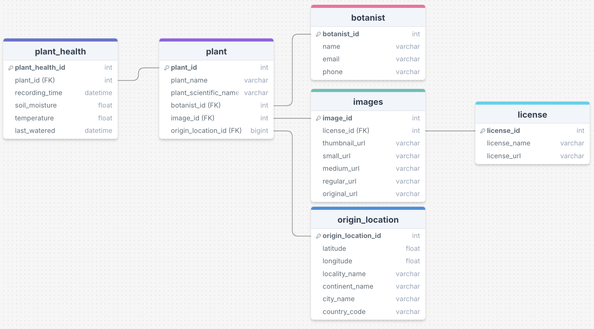

# Welcome to the LMNH Plants Data Pipeline!

### Downloading Terraform and Docker

To Install Terraform and Docker run 

```bash
brew install terraform
brew install docker
```
If you aren't using brew to install these requirements, you can use

[Docker](https://docs.docker.com/engine/install/)

[Terraform](https://developer.hashicorp.com/terraform/tutorials/aws-get-started/install-cli)

And follow the instructions there to set up each respective requirement

#

### Folders Overview

Each folder has a `README.md` file that explains how to setup and run the scripts in that folder.

`archive` -> Archive folder containing unused scripts that may be useful at a later time.

`dashboard` -> Dashboard folder containing a dockerfile and terraform file for the dashboard created in this project. It also contains the script used to run the StreamLit dashboard where the visualisation is hosted. 

`images` -> Images Folder containing images used in README.md

`long_term_storage` -> Long_term_storage folder containing a dockerfile and terraform file for an AWS lambda script that reads data from an AWS RDS, deletes data older than 24 hours and uploads it to an AWS S3 bucket as a parquet file. 

`pipeline` -> Pipeline folder containing a dockerfile and terraform file for the ETL pipeline that reads from an API instance and uploads it to an AWS RDS.

#

### Architecture Diagram

The Architect Diagram represents the AWS cloud Infrastructure used in the project.


#

### ERD Diagram

The schema diagram showing the entity relationships between the tables in the database is shown below where the data retrieved from the plants API is normalised using 3NF.



#

### Contributors 

This project was developed by the following contributors:

[Anna Camplani](https://github.com/annac02)

[Miles Drabwell](https://github.com/MilesDrabwell)

[Linfan Siddiqi](https://github.com/LinfanS)

[Jonathan Spence](https://github.com/HighestAuto)

Pull requests are welcome. For major changes, please open an issue first
to discuss what you would like to change.

### Trello Board link

Link to the trello board used for this project.

[Trello](https://trello.com/invite/b/66b09529e948b39b40c0d844/ATTIa0f28bce4764f3e71f9e0ea9cde2b152007BC558/based-lmnh-project)